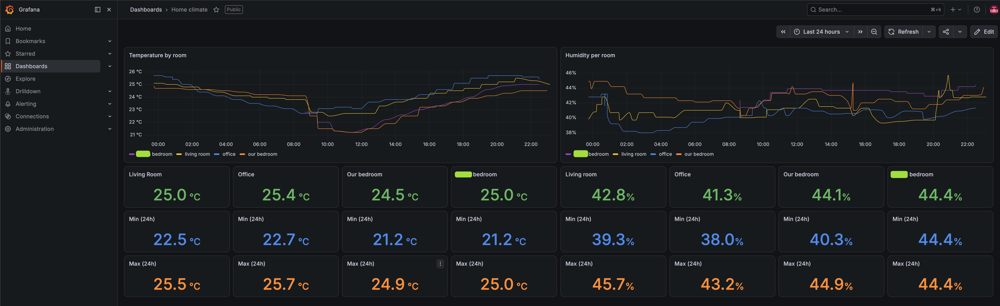
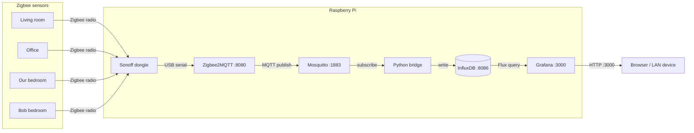

# Home Climate

A full-stack home climate monitoring system built on a Raspberry Pi, using Zigbee wireless sensors, Zigbee2MQTT, InfluxDB, and Grafana.

## Software stack

| Component | Purpose | Port |
|---|---|---|
| Mosquitto | MQTT broker | 1883 |
| Zigbee2MQTT | Zigbee coordinator + MQTT bridge | 8080 |
| InfluxDB 2.x | Time-series database | 8086 |
| Python bridge | MQTT → InfluxDB writer | — |
| Grafana | Dashboard + visualisation | 3000 |

## Architecture

## Hardware

- Raspberry Pi (4B or 3B+, 64-bit OS required)
- Sonoff Zigbee 3.0 USB Dongle Plus (coordinator)
- SONOFF SNZB-02P sensors (one per room, temperature + humidity, battery powered)

